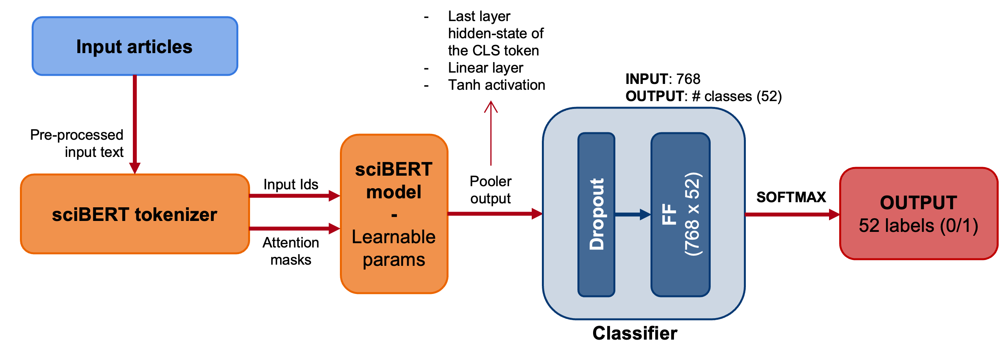
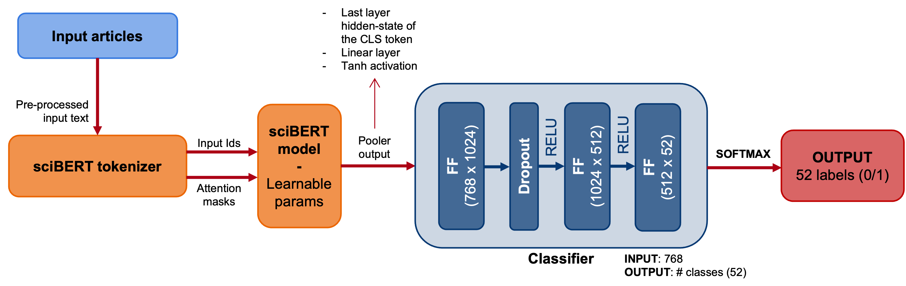
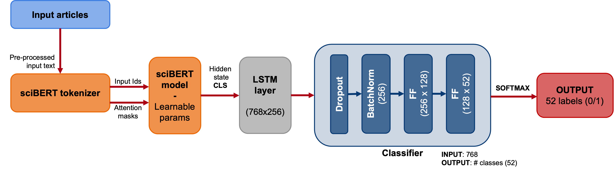

# Multilabel document classification in an imbalanced dataset using transformers

This is the main repository for the Internship Thesis developed by Paula Sorolla.
The project is intended to provide improvements and new approaches to the document-level classification component in the Canary pipeline.

The goal and all previous work made at Elsevier are summarized in the following [Confluence page](https://confluence.elsevier.com/display/ContentAssets/Document-Level+Classification).

## Table of Contents

1. [Repository Structure](#repository-structure)
2. [Setup](#setup)
    - [Configurations](#configurations)
3. [Multilabel classifier](#multilabel-classifier)
    - [Problem definition](#problem-definition)
    - [Network architecture](#network-architecture)
    - [Loss functions](#loss-functions)
4. [Contact](#contact)


## Repository Structure

Below is the structure of the repo with a brief description.

```
repo/
  notebooks/    
    BERT_classifier.ipynb - Includes the working notebook where the first experiments have been setup and run
  src/
    BuildModels.py - Includes the Classifier network models to be chosen for training in the experimental phase
    LossFunctions.py - Includes different Loss functions definitions to be chosen for training in the experimental phase
    Postprocessing.py - Includes functions to compute metrics and retrieve results form the experiments
    Preprocessing.py - Includes functions to load the and setup the required datasets necessary for the experiments
    utils.py - Help functions used throughout the process
  main.py - Main executable file. This is used for both train/testing of the model. Different configurations can be chosen
  Train.py - Includes the Training and Evaluation metohds for the multilabel classification
  Test.py - Includes the Inference metohds for testing the multilabel classification
  README.md - README providing useful information of the project
  requirements.txt - The requirements file for reproducing the analysis in an Python3 environment
  
```

## Setup

1. Create a virtual environment and install the requirements specified in "requirements.txt" 

```bash
    pip install virtualenv
    virtualenv Thesis
    source Thesis/bin/activate
    pip install -r requirements.txt
  ```

2. Then run the **main** file with the desired configuration. Some examples can provided:

Example for **TRAINING**:

```bash
    python main.py -tr True -dp ~/data/ -op ~/outputs/ -lr 1e-5 -mn 'best_model.pt' -j 2 -thr 0.5 -b 32 -tm 512 -e 10 -lf 'BCE' -do 0.5

  ```

Example for **TESTING**:

```bash
    python main.py -tr False -dp ~/data/ -op ~/outputs/ -lr 1e-5 -mn 'best_model.pt' -j 2 -thr 0.5 -b 32 -tm 512 -e 10 -lf 'BCE' -do 0.5

  ```

<!-- 3. To solve possible errors with NLTK download, run:

```bash
  import nltk
  import ssl

  try:
      _create_unverified_https_context = ssl._create_unverified_context
  except AttributeError:
      pass
  else:
      ssl._create_default_https_context = _create_unverified_https_context

  nltk.download()
  ``` -->

### Configurations

    a. --train(-tr): if True then model starts training, otherwise the model will be only used for test (inference).
    b. --data_path(-dp): The directory path to the dataset
    c. --output_path(-op): The directory path to the outputs (both for saving/loading)
    d. --learning_rate(-lr): Learning rate for training phase
    e. --model_name(-mn): Model name for saving/loading for training/testiing
    f. --workers(-j): Number of data loading workers
    g. --threshold(-thr): Threshold value
    h. --batch_size(-b): Batch size for both train and testing
    i. --tokenizer_max(-tm): Tokenizer max length of the BERT model 
    j. --num_epochs(-e): Number of training epochs
    k. --loss_function(-lf): Loss function to be used to compute the gradient during training


## Multilabel Classififer

### **Problem definition**:

Given a dataset of **500k samples** of scientific articles, labelled into **52 classes**, a multilabel classification problem is defined.

* The samples correspond to the concatenated *Title + Keywords from CARs + Abstract + (2nd abstract)* of the aforementioned articles.
* The 52 classes correspond to *Emtree terms* -> a hierarchically structured, controlled vocabulary for 	biomedicine and related life sciences, frequently used as index terms in Embase

The multilabel classification problem corresponds to the task of attributing multiple labels to examples via predictions. In the given dataset, an average of 6.6 labels per sample is observed.

### **Network architecture**:

This repository includes 3 different neural network arquitectures that are being currently tested for comparison:

1. BERT base classifier using SciBERT followed by a linear layer:


1. BERT base classifier using SciBERT followed by 3 linear layers:


2. BERT base classifier using SciBERT followed by an LSTM layer and a Classification head


### **Loss functions**:

The loss functions that are currently being tested in this project are:

1. Binary Cross Entropy - [Pytorch](https://pytorch.org/docs/stable/generated/torch.nn.BCEWithLogitsLoss.html)
2. SigmoidF1: A Smooth F1 Score Surrogate Loss - [See paper](https://arxiv.org/pdf/2108.10566.pdf)
3. Asymmetric Loss - [See Paper](https://arxiv.org/pdf/2009.14119.pdf)
4. Focal Loss - [See Paper](https://arxiv.org/pdf/1708.02002.pdf)


# Contact

For any questions regarding the work done, please contact Paula Sorolla Bayod: [p.sorollabayod@elsevier.com](mailto:p.sorollabayod@elsevier.com) or [paula.sorolla@gmail.com](mailto:paula.sorolla@gmail.com)
